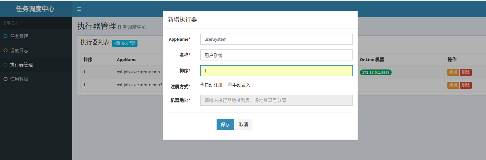
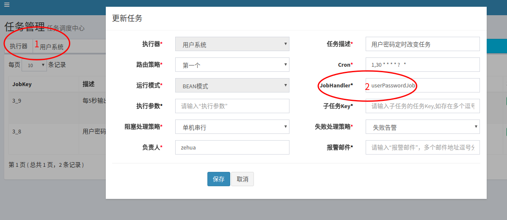
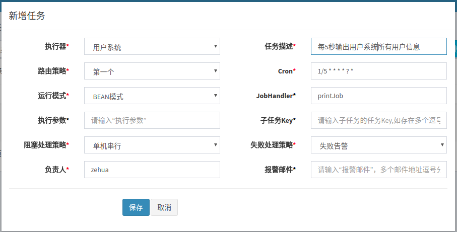
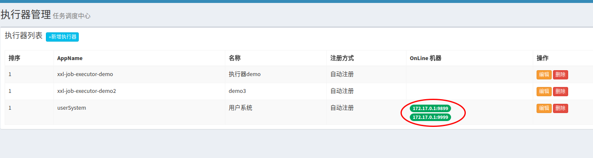
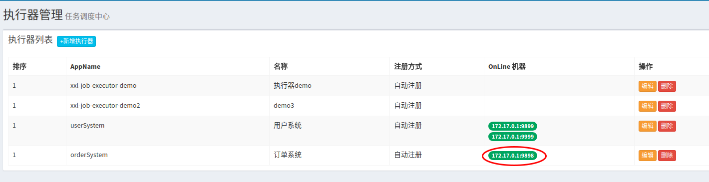

# xxl-job执行器端(客户端)使用demo

## 项目背景

- 演示如何使用xxl-job执行器端

## 分支介绍

- master：唯一分支

## xxl-job使用了解（必读）

- [xxl-job使用教程](doc/xxl-job-task-simple.md)

## xxl-job原理了解（选读）
- [xxl-job架构](doc/xxl-job-architecture.md)
- [xxl-job调度中心原理](doc/xxl-job-center.md)
- [xxl-job执行器原理](doc/xxl-job-task-simple.md)

## 技术选型

- 开发环境
    - IntelliJ IDEA
    - JDK8
    - Maven 3.5.x
    - lombok 1.16.18
- 使用框架
    - Spring Boot
    - Swagger2
    - Druid
    - Log4j2
    - MyBatis
    - MyBatis Plus
    - MySQL
    - xxl-job


## 搭建环境

- 必备操作：
	- 初始化数据库与数据源
	- 详细看[xxl-job使用教程](doc/xxl-job-task-simple.md)

## 各demo系统使用(假设场景,无实质功能实现)介绍
### 用户系统(user-system)
- 假设场景:
    - 为了用户的密码安全,用户密码在服务器系统时间的1分钟内的前30秒和后30秒不一样.
    - 密码变换规则:每分钟内后30秒的密码为前30秒的密码的逆序
#### 基本配置(执行器配置)
- application.yaml对xxl-job的配置(完整配置直接看`user-system`模块代码或[xxl-job使用教程](doc/xxl-job-task-simple.md)),
```yaml
# xxl-job
### 调度中心部署地址
xxl.job.admin.addresses: http://127.0.0.1:8080

### 应用名填系统的名称(同一集群下的名称必须相同)
xxl.job.executor.appname: userSystem

### 执行器与调度中心的通讯端口
xxl.job.executor.port: 9999
```
- 在调度中心添加对应执行器,配置应用名称为用户系统`userSystem`,注意要选择`自动配置`的注册方式(否则要配用户系统的ip地址),这样当用户系统`userSystem`启动后调度中心就可以把添加的任务交给用户系统执行.


### 任务配置

- 用户密码定时变更任务类,`@JobHander(value="userPasswordJob")`注解让执行器知道自己是用户密码改变任务`userPasswordJob`.

```java
@JobHander(value="userPasswordJob")
@Service
public class UserPasswordJobHandler extends IJobHandler {
	@Autowired
	UserService userService;

	@Override
	public ReturnT<String> execute(String... params) {
		XxlJobLogger.log("这里记录执行日志才能在执行日志中看到(其他日志不受影响)");
		try{
			userService.reverseAllUserPassword();
		}catch (Throwable t){
			XxlJobLogger.log("任务执行失败");
			return ReturnT.FAIL;
		}
		XxlJobLogger.log("任务执行成功");
		System.out.println("任务执行成功");
		return ReturnT.SUCCESS;
	}
}
```     
- 在调度中心选择用户系统执行器,并添加一个用户密码定时改变任务,cron表达式`1,30 * * * * ? `的意思是每分钟内的第1秒和第30秒对密码进行逆序,`JobHandler`配`userPasswordJob`是让调度中心知道自己调度的是用户密码改变任务.
   


- 定时用户信息输出任务类
```java
@JobHander(value="printJob")
@Service
public class PrintJobHandler extends IJobHandler {
    @Autowired
    UserService userService;
    @Override
    public ReturnT<String> execute(String... params) throws Exception {
        List<UserEntity> userEntities = userService.selectListBySQL();
        userEntities.forEach(userEntity -> System.out.println(userEntity));
        return ReturnT.SUCCESS;
    }
}
```
- 在调度中心选择用户系统执行器,并添加一个用户信息输出任务,配置cron为`1/5 * * * * ? *`(每5秒执行一次任务)


- 任务系统输出结果
```log
UserEntity{id=1, username='test', password='drowssap', status='on'}
11:44:26.171 logback [Thread-8] WARN  xxl-job logger - [2018-03-22/15901.log]: 2018-03-22 11:44:26 [com.xxl.job.core.thread.JobThread]-[run]-[124]-[Thread-8] <br>----------- xxl-job job execute end(finish) -----------<br>----------- ReturnT:ReturnT [code=200, msg=null, content=null]
11:44:26.237 logback [Thread-5] INFO  c.x.j.c.thread.TriggerCallbackThread - >>>>>>>>>>> xxl-job callback success, callbackParamList:[HandleCallbackParam{logId=15901, executeResult=ReturnT [code=200, msg=null, content=null]}], callbackResult:ReturnT [code=200, msg=null, content=null]
11:44:30.168 logback [Thread-9] WARN  xxl-job logger - [2018-03-22/15902.log]: 2018-03-22 11:44:30 [com.xxl.job.core.thread.JobThread]-[run]-[117]-[Thread-9] <br>----------- xxl-job job execute start -----------<br>----------- Params:null
11:44:30.168 logback [Thread-9] WARN  xxl-job logger - [2018-03-22/15902.log]: 2018-03-22 11:44:30 [com.bg.xxlJob.demo.jobhandler.UserPasswordJobHandler]-[execute]-[29]-[Thread-9] 这里记录执行日志才能在执行日志中看到(其他日志不受影响)
11:44:30.194 logback [Thread-9] WARN  xxl-job logger - [2018-03-22/15902.log]: 2018-03-22 11:44:30 [com.bg.xxlJob.demo.jobhandler.UserPasswordJobHandler]-[execute]-[36]-[Thread-9] 任务执行成功
任务执行成功
11:44:30.195 logback [Thread-9] WARN  xxl-job logger - [2018-03-22/15902.log]: 2018-03-22 11:44:30 [com.xxl.job.core.thread.JobThread]-[run]-[124]-[Thread-9] <br>----------- xxl-job job execute end(finish) -----------<br>----------- ReturnT:ReturnT [code=200, msg=null, content=null]
11:44:30.250 logback [Thread-5] INFO  c.x.j.c.thread.TriggerCallbackThread - >>>>>>>>>>> xxl-job callback success, callbackParamList:[HandleCallbackParam{logId=15902, executeResult=ReturnT [code=200, msg=null, content=null]}], callbackResult:ReturnT [code=200, msg=null, content=null]
11:44:31.168 logback [Thread-8] WARN  xxl-job logger - [2018-03-22/15903.log]: 2018-03-22 11:44:31 [com.xxl.job.core.thread.JobThread]-[run]-[117]-[Thread-8] <br>----------- xxl-job job execute start -----------<br>----------- Params:null
UserEntity{id=1, username='test', password='password', status='on'}
11:44:31.174 logback [Thread-8] WARN  xxl-job logger - [2018-03-22/15903.log]: 2018-03-22 11:44:31 [com.xxl.job.core.thread.JobThread]-[run]-[124]-[Thread-8] <br>----------- xxl-job job execute end(finish) -----------<br>----------- ReturnT:ReturnT [code=200, msg=null, content=null]
11:44:31.275 logback [Thread-5] INFO  c.x.j.c.thread.TriggerCallbackThread - >>>>>>>>>>> xxl-job callback success, callbackParamList:[HandleCallbackParam{logId=15903, executeResult=ReturnT [code=200, msg=null, content=null]}], callbackResult:ReturnT [code=200, msg=null, content=null]
11:44:36.164 logback [Thread-8] WARN  xxl-job logger - [2018-03-22/15904.log]: 2018-03-22 11:44:36 [com.xxl.job.core.thread.JobThread]-[run]-[117]-[Thread-8] <br>----------- xxl-job job execute start -----------<br>----------- Params:null
UserEntity{id=1, username='test', password='password', status='on'}
11:44:36.168 logback [Thread-8] WARN  xxl-job logger - [2018-03-22/15904.log]: 2018-03-22 11:44:36 [com.xxl.job.core.thread.JobThread]-[run]-[124]-[Thread-8] <br>----------- xxl-job job execute end(finish) -----------<br>----------- ReturnT:ReturnT [code=200, msg=null, content=null]
11:44:36.225 logback [Thread-5] INFO  c.x.j.c.thread.TriggerCallbackThread - >>>>>>>>>>> xxl-job callback success, callbackParamList:[HandleCallbackParam{logId=15904, executeResult=ReturnT [code=200, msg=null, content=null]}], callbackResult:ReturnT [code=200, msg=null, content=null]
11:44:41.151 logback [Thread-8] WARN  xxl-job logger - [2018-03-22/15905.log]: 2018-03-22 11:44:41 [com.xxl.job.core.thread.JobThread]-[run]-[117]-[Thread-8] <br>----------- xxl-job job execute start -----------<br>----------- Params:null
UserEntity{id=1, username='test', password='password', status='on'}
11:44:41.153 logback [Thread-8] WARN  xxl-job logger - [2018-03-22/15905.log]: 2018-03-22 11:44:41 [com.xxl.job.core.thread.JobThread]-[run]-[124]-[Thread-8] <br>----------- xxl-job job execute end(finish) -----------<br>----------- ReturnT:ReturnT [code=200, msg=null, content=null]
11:44:41.212 logback [Thread-5] INFO  c.x.j.c.thread.TriggerCallbackThread - >>>>>>>>>>> xxl-job callback success, callbackParamList:[HandleCallbackParam{logId=15905, executeResult=ReturnT [code=200, msg=null, content=null]}], callbackResult:ReturnT [code=200, msg=null, content=null]
11:44:43.746 logback [Thread-4] INFO  c.x.j.c.t.ExecutorRegistryThread - >>>>>>>>>>> xxl-job registry success, registryParam:RegistryParam{registGroup='EXECUTOR', registryKey='userSystem', registryValue='172.17.0.1:9999'}, registryResult:ReturnT [code=200, msg=null, content=null]
11:44:46.232 logback [Thread-8] WARN  xxl-job logger - [2018-03-22/15906.log]: 2018-03-22 11:44:46 [com.xxl.job.core.thread.JobThread]-[run]-[117]-[Thread-8] <br>----------- xxl-job job execute start -----------<br>----------- Params:null
UserEntity{id=1, username='test', password='password', status='on'}
11:44:46.237 logback [Thread-8] WARN  xxl-job logger - [2018-03-22/15906.log]: 2018-03-22 11:44:46 [com.xxl.job.core.thread.JobThread]-[run]-[124]-[Thread-8] <br>----------- xxl-job job execute end(finish) -----------<br>----------- ReturnT:ReturnT [code=200, msg=null, content=null]
11:44:46.295 logback [Thread-5] INFO  c.x.j.c.thread.TriggerCallbackThread - >>>>>>>>>>> xxl-job callback success, callbackParamList:[HandleCallbackParam{logId=15906, executeResult=ReturnT [code=200, msg=null, content=null]}], callbackResult:ReturnT [code=200, msg=null, content=null]
11:44:51.155 logback [Thread-8] WARN  xxl-job logger - [2018-03-22/15907.log]: 2018-03-22 11:44:51 [com.xxl.job.core.thread.JobThread]-[run]-[117]-[Thread-8] <br>----------- xxl-job job execute start -----------<br>----------- Params:null
UserEntity{id=1, username='test', password='password', status='on'}
11:44:51.161 logback [Thread-8] WARN  xxl-job logger - [2018-03-22/15907.log]: 2018-03-22 11:44:51 [com.xxl.job.core.thread.JobThread]-[run]-[124]-[Thread-8] <br>----------- xxl-job job execute end(finish) -----------<br>----------- ReturnT:ReturnT [code=200, msg=null, content=null]
11:44:51.225 logback [Thread-5] INFO  c.x.j.c.thread.TriggerCallbackThread - >>>>>>>>>>> xxl-job callback success, callbackParamList:[HandleCallbackParam{logId=15907, executeResult=ReturnT [code=200, msg=null, content=null]}], callbackResult:ReturnT [code=200, msg=null, content=null]
11:44:56.161 logback [Thread-8] WARN  xxl-job logger - [2018-03-22/15908.log]: 2018-03-22 11:44:56 [com.xxl.job.core.thread.JobThread]-[run]-[117]-[Thread-8] <br>----------- xxl-job job execute start -----------<br>----------- Params:null
UserEntity{id=1, username='test', password='password', status='on'}
11:44:56.166 logback [Thread-8] WARN  xxl-job logger - [2018-03-22/15908.log]: 2018-03-22 11:44:56 [com.xxl.job.core.thread.JobThread]-[run]-[124]-[Thread-8] <br>----------- xxl-job job execute end(finish) -----------<br>----------- ReturnT:ReturnT [code=200, msg=null, content=null]
11:44:56.223 logback [Thread-5] INFO  c.x.j.c.thread.TriggerCallbackThread - >>>>>>>>>>> xxl-job callback success, callbackParamList:[HandleCallbackParam{logId=15908, executeResult=ReturnT [code=200, msg=null, content=null]}], callbackResult:ReturnT [code=200, msg=null, content=null]
11:45:01.182 logback [Thread-9] WARN  xxl-job logger - [2018-03-22/15909.log]: 2018-03-22 11:45:01 [com.xxl.job.core.thread.JobThread]-[run]-[117]-[Thread-9] <br>----------- xxl-job job execute start -----------<br>----------- Params:null
11:45:01.183 logback [Thread-9] WARN  xxl-job logger - [2018-03-22/15909.log]: 2018-03-22 11:45:01 [com.bg.xxlJob.demo.jobhandler.UserPasswordJobHandler]-[execute]-[29]-[Thread-9] 这里记录执行日志才能在执行日志中看到(其他日志不受影响)
11:45:01.196 logback [Thread-9] WARN  xxl-job logger - [2018-03-22/15909.log]: 2018-03-22 11:45:01 [com.bg.xxlJob.demo.jobhandler.UserPasswordJobHandler]-[execute]-[36]-[Thread-9] 任务执行成功
任务执行成功
11:45:01.204 logback [Thread-9] WARN  xxl-job logger - [2018-03-22/15909.log]: 2018-03-22 11:45:01 [com.xxl.job.core.thread.JobThread]-[run]-[124]-[Thread-9] <br>----------- xxl-job job execute end(finish) -----------<br>----------- ReturnT:ReturnT [code=200, msg=null, content=null]
11:45:01.255 logback [Thread-5] INFO  c.x.j.c.thread.TriggerCallbackThread - >>>>>>>>>>> xxl-job callback success, callbackParamList:[HandleCallbackParam{logId=15909, executeResult=ReturnT [code=200, msg=null, content=null]}], callbackResult:ReturnT [code=200, msg=null, content=null]
11:45:01.438 logback [Thread-8] WARN  xxl-job logger - [2018-03-22/15910.log]: 2018-03-22 11:45:01 [com.xxl.job.core.thread.JobThread]-[run]-[117]-[Thread-8] <br>----------- xxl-job job execute start -----------<br>----------- Params:null
UserEntity{id=1, username='test', password='drowssap', status='on'}
```
- 在输出结果中可以看到每一分钟里的第1秒和第30秒都会输出`任务执行成功`(这个是在用户密码改变任务`serPasswordJobHandler`中输出的,代表用户密码改变成功),并且用户信息打印任务中每5秒输出的用户信息`UserEntity{id=1, username='test', password='password', status='on'}`中的`password`会在每一分钟里的第1秒和第30秒进行逆序改变.


### 模拟用户系统`userSystem`集群时xxl-job的情况

- 为了模拟,我复制一个与`user-system`一模一样的项目`user-system2`
#### 基本配置(执行器配置)
- application.yaml中的xxl-job配置中只需改个通讯端口(不同机子运行时,不用改任何配置)
```yaml
# xxl-job
### 调度中心部署地址
xxl.job.admin.addresses: http://127.0.0.1:8080

### 应用名填系统的名称(同一集群下的名称必须相同)
xxl.job.executor.appname: userSystem

### 执行器与调度中心的通讯端口
xxl.job.executor.port: 9899
```
- 在调度中心**不用**添加新的执行器,并且因为采用**自动注册**的注册方式,不用修改原来的用户系统执行器.

#### 任务配置
- 同样无需变化

#### 运行结果



- 可以看到用户系统`userSystem`执行器的在线机器集群多了一个端口为`9899`的机子
- 同时由于添加任务时设置的任务路由策略都为`第一个`,所以可以从`userSystem`和`userSystem2`系统中的输出日志中看到集群中同一个任务的同一次调度只有一个用户系统的`UserPasswordJobHandler`被执行.
- 想详细了解任务的路由策略可以看[xxl-job调度中心的任务配置说明](doc/xxl-job-configure.md)

### 订单系统
#### 基本配置(执行器配置)
- application.yaml中的xxl-job配置.不同的系统中,配置的`appname`必须不一样,以区分不同的集群
```yaml
# xxl-job
### 调度中心部署地址
xxl.job.admin.addresses: http://127.0.0.1:8080

### 应用名填系统的名称(同一集群下的名称必须相同)
xxl.job.executor.appname: orderSystem

### 执行器与调度中心的通讯端口
xxl.job.executor.port: 9898
```
- 在调度中心添加**新**的执行器,配置应用名称为用户系统`orderSystem`,同样选择`自动配置`的注册方式


#### 任务配置
- 安业务需求配置相应的任务即可.

#### 运行结果



- 可以看到刚刚运行的订单系统自动注册到了调度中心中的订单系统执行器.


