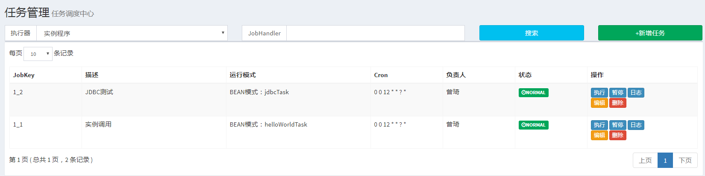

# 分布式调度任务—客户端接入文档

## 背景
分布式调度采用的是XXL-JOB，其官方文档请参考[这里](http://www.xuxueli.com/xxl-job/#/)，所以本文档主要是基于XXL-JOB来开发自己的业务逻辑，同时也让业务线开发的同事关注自己的业务逻辑，而减少技术上的纠结。关于XXL-JOB特性的问题，请参考[官方文档](http://www.xuxueli.com/xxl-job/#/?id=_11-%e6%a6%82%e8%bf%b0)

## 快速开始

### 1，基础项目构建
项目构建分两种方式：
- 1，是下载[demo项目](http://192.168.1.122:3000/architecture/distributed-job/src/develop/bg-job-executor-demo)，然后修改一下成为自己的业务任务中心系统
        
        demo中任务代码demo放在com.banggood.job.executor.task包下，大家可以参考
        
- 2，按照棒谷骨架生成基础项目
  - 2.1 按照[文档](http://192.168.1.122:3000/architecture/Wiki/src/master/maven-archetype/maven-archetype-create-project.md)生成棒谷基础框架
  - 2.2 按照[文档](http://192.168.1.122:3000/architecture/Wiki/src/master/security-clear.md)剔除掉骨架里面的`Spring Security`框架
  - 2.3 `pom.xml`引入`xxl-job-core`的依赖
  
    ```xml
      <properties>
        <xxl.job.core.version>1.8.2</xxl.job.core.version>
      </properties>
    
  
       <dependency>
        <groupId>com.xuxueli</groupId>
        <artifactId>xxl-job-core</artifactId>
        <version>${xxl.job.core.version}</version>
      </dependency>
  ```
    
    - 2.4 配置XXL-JOB的执行器项目配置
        - 2.4.1 Java配置代码如下
        
        ```java
          @Configuration
          @ComponentScan(basePackages = "com.banggood.job.executor.task")
          public class XxlJobConfig {
              private Logger logger = LoggerFactory.getLogger(XxlJobConfig.class);
          
          
              @Value("${xxl.job.admin.addresses}")
              private String addresses;
          
              @Value("${xxl.job.executor.appname}")
              private String appname;
          
              @Value("${xxl.job.executor.ip}")
              private String ip;
          
              @Value("${xxl.job.executor.port}")
              private int port;
          
              @Value("${xxl.job.executor.logpath}")
              private String logpath;
          
              @Value("${xxl.job.accessToken}")
              private String accessToken;
          
              @Bean(initMethod = "start", destroyMethod = "destroy")
              public XxlJobExecutor xxlJobExecutor() {
                  logger.info(">>>>>>>>>>> xxl-job config init.");
                  XxlJobExecutor xxlJobExecutor = new XxlJobExecutor();
                  xxlJobExecutor.setIp(ip);
                  xxlJobExecutor.setPort(port);
                  xxlJobExecutor.setAppName(appname);
                  xxlJobExecutor.setAdminAddresses(addresses);
                  xxlJobExecutor.setLogPath(logpath);
                  xxlJobExecutor.setAccessToken(accessToken);
                  return xxlJobExecutor;
              }
          
          }
        ```
        
        - 2.4.2 增加`application.yaml`配置
        
        ```yaml
          # log config
          logging:
            config: classpath:logback.xml
          
          # xxl-job
          ### xxl-job admin address list, such as "http://address" or "http://address01,http://address02"
          xxl:
            job:
              admin:
                addresses: ${XXL-JOB-ADMIN-URL:http://192.168.1.151:8480/xxl-job-admin} #调度中心url
              executor:
                appname: xxl-job-executor-sample  #当前任务器的名字
                ip:
                port: ${XXL-JOB-EXECUTOR-PORT:9998} #调度中心调度任务的端口
                logpath: ${XXL-JOB-LOG-PATH:/var/log/xxl-job-executor-demo/} # 日志位置
              accessToken: ${XXL-JOB-ACCESSTOKEN:emVuZ3FpLWJhbmdnb29k} #简单安全AccessToken
        ```
        
        上面各个配置都给了默认值，需要注意的4个地方分别是***调度中心url***、***当前任务器的名字***、***调度任务的端口***和***AccessToken***
        
        |概念|注意|
        |:-----|:-----|
        |调度中心url|调度中心url必须admin的地址|
        |当前任务器的名字|和新增执行器弹框的`AppName`必须一致|
        |调度任务的端口|在编写Kubernetes的Yaml文件时，必须开放期端口|
        |AccessToken|调度中心和执行中心必须一致，否则任务调度不到|
        
        - 2.4.3 在resources的根目录下增加`logback.xml`的日志配置
        
        ```xml
          <?xml version="1.0" encoding="UTF-8"?>
          <configuration debug="false" scan="true" scanPeriod="1 seconds">
          
              <contextName>logback</contextName>
              <property name="log.path" value="/var/log/xxl-job/xxl-job-executor-demo.log"/>
          
              <appender name="console" class="ch.qos.logback.core.ConsoleAppender">
                 <!-- <filter class="ch.qos.logback.classic.filter.ThresholdFilter" >
                      <level>WARN</level>
                  </filter>-->
                  <encoder>
                      <pattern>%d{HH:mm:ss.SSS} %contextName [%thread] %-5level %logger{36} - %msg%n</pattern>
                  </encoder>
              </appender>
          
              <appender name="file" class="ch.qos.logback.core.rolling.RollingFileAppender">
                  <file>${log.path}</file>
                  <rollingPolicy class="ch.qos.logback.core.rolling.TimeBasedRollingPolicy">
                      <fileNamePattern>${log.path}.%d{yyyy-MM-dd}.zip</fileNamePattern>
                  </rollingPolicy>
                  <encoder>
                      <pattern>%date %level [%thread] %logger{36} [%file : %line] %msg%n
                      </pattern>
                  </encoder>
              </appender>
          
              <root level="info">
                  <appender-ref ref="console"/>
                  <appender-ref ref="file"/>
              </root>
          
              <!--<logger name="com.xxl.job.executor.service.info" level="WARN" additivity="false">
                  <appender-ref ref="console"/>
                  <appender-ref ref="file"/>
              </logger>-->
          
          </configuration>
        ```
        
        - 2.4.4 编写任务代码，继承`IJobHandler`，用`@Service`将任务类加入Spring，使用`@JobHander("xxx")`指定JobKey。
        
        ```java
          @Service
          @JobHander("helloWorldTask")
          public class HelloWorldTask extends IJobHandler {
              @Override
              public ReturnT<String> execute(String... params) throws Exception {
                  //使用此类型日志，才能在xxl-job-admin的网页上看到打印日志
                  XxlJobLogger.log("xxl job hello world");
                  return ReturnT.SUCCESS;
              }
          }
        ```
        
        上面`@JobHander`指定的JobKey要和指定运行模式为***BEAN模式***下，和***JobHandler***要一致。关于执行参数请参考[官方代码](https://github.com/xuxueli/xxl-job/tree/master/xxl-job-executor-samples/xxl-job-executor-sample-springboot/src/main/java/com/xxl/job/executor/service/jobhandler)使用。
        
        
- 3，新增任务执行器，在【执行器管理】点击【新增执行器】按钮，会弹出框，填写完信息后，点击保存会显示多一条新增的记录
    
        注意：在新增执行器的时候，需要填写的AppName必须与上面配置文件配置的`AppName`一致，否则自动注册无法关联。
    
    保存成功后如下显示，在***OnLine 机器***一栏没有信息
    
    
    - 3.1 重启执行器系统后，在配置正确的情况下，如下图所示，也就是***OnLine 机器***已经找到对应的节点
        
        
- 4，新增并执行任务，查看日志
    - 4.1，在【任务管理】界面点击【新增任务】按钮，注意填写***BEAN模式***和***JobHandler***
    - 4.2，新增成功后，点击【执行】按钮执行任务
    
    - 4.3 查看日志，点击上面的【日志按照】，在新界面中点击【查看】和【执行日志】，如下图所示
    
    